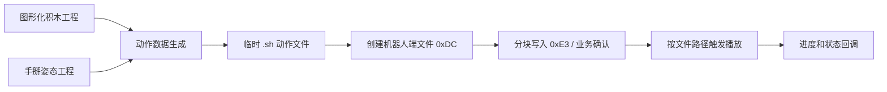

# K-ONE 图形化编程、手掰编程与 BLE：Flutter 复刻参考报告

> 分析对象：`com.robosen.K1app`，版本 `4.75.20260601`（versionCode 75）。报告基于项目内 APK、Unity IL2CPP 元数据、原生 ARM64 汇编及现有协议分析。编写日期：2026-10-07。

## 1. 结论与使用边界

原 App 的两种编程模式共用一条执行链：**编辑动作 → 保存工程 → 生成机器人动作文件 → BLE 上传 → 触发播放并接收进度**。图形化编程以连接的积木表示动作；手掰编程从机器人读取当前关节值，将多个姿态记录成动作序列。

对 Flutter 版本，可以先实现 BLE 连接、协议层和两种**本地编辑工程**；要让机器人实际执行，还必须补齐动作文件 `.sh` 的生成规则及关键载荷。现有静态分析已确认 BLE 帧格式、连接顺序和文件上传流程，但**没有实机抓包或运动验证**。不要把“有方法名/枚举项”当成已验证的固件能力。

本报告的证据等级：

- **A：原生机器码或 Android Java 调用链核对**，例如组帧、`0xE9` 请求、文件分块上传。
- **B：IL2CPP 类型与字段确认**，例如积木与工程数据结构；生成的 C# `{ }` 是占位方法体。
- **C：Flutter 设计建议**，便于复刻和迭代，不代表原 App 内部采用相同实现。

底层 BLE 的完整依据与限制见[蓝牙协议分析](蓝牙协议分析.md)；反编译产物的使用方式见[分析 README](../README.md)。

## 2. 原 App 的共同执行链



图形化编辑器出现 `CacheAction/VisualEditorTemp.sh`，手掰编辑器出现 `CacheAction/ManualEditorTemp.sh`。两条运行路径均调用动作文件上传，并使用 `0x17` 发送播放相关请求。接收侧也将 `0x17` 分发为动作进度。`0x17` 的具体请求载荷应以实机抓包核对，不能只依据枚举名推定。[图形化运行路径](../native/_RunEditorBlocks_New_d__164.MoveNext.208c234.asm) · [手掰运行路径](../native/_RunningManualAction_New_d__132.MoveNext.206cfa4.asm) · [指令枚举](指令枚举.md)

上传与 BLE ATT 分片是**两层不同的分片**：动作文件业务层每块最多 65 字节，随后整个协议帧仍需依实际协商 MTU 写入 GATT。原 App 对创建文件与写块都等待机器人业务确认。[文件传输证据](蓝牙协议分析.md#8-动作文件传输)

## 3. 图形化编程：已确认的实现

### 3.1 编辑器和交互

原 App 使用 Unity UI 工作区与积木预制体。`VisualViewBase` 实现按下、抬起、开始拖动、拖动和结束拖动事件；每个 UI 积木有父节点、子节点列表及对应的数据模型。[VisualViewBase](../cpp2il/DiffableCs/Assembly-CSharp/VisualViewBase.cs) · [编辑器工作区字段](../cpp2il/DiffableCs/Assembly-CSharp/EditorVisualInterfaceScript.cs)

积木基础模型保存画布坐标、`Id`、`ParentBlockId`、`childIds`。这说明**UI 位置**与**程序连接关系**都是工程的一部分；仅按屏幕上下顺序排列积木无法完整复刻。[BlockModelBase](../cpp2il/DiffableCs/Assembly-CSharp/BlockModelBase.cs)

| 积木/数据 | APK 中可见字段 | Flutter 中建议表达 |
|---|---|---|
| 起始 | `StartBlockModel` | 唯一根节点及初始姿态/模式 |
| 动作 | 速度、延时 | 一个动作步骤，包含若干关节目标 |
| 动作子积木 | 关节编号、运动值、启用状态、灯光值 | 关节目标或附加效果 |
| 循环 | `LoopTimes` | 有界循环及其子节点 |
| 单条指令 | `SingleCommandType`：`RobotPose`、`LongPose` | 预定义姿态指令 |
| 舞蹈 | 有 UI/模型类型 | 具体运行语义待进一步核对 |

字段依据：[BlockType](../cpp2il/DiffableCs/Assembly-CSharp/BlockType.cs)、[ActionBlockModel](../cpp2il/DiffableCs/Assembly-CSharp/ActionBlockModel.cs)、[ActionBlockChildModel](../cpp2il/DiffableCs/Assembly-CSharp/ActionBlockChildModel.cs)、[LoopBlockModel](../cpp2il/DiffableCs/Assembly-CSharp/LoopBlockModel.cs)、[SingleCommandType](../cpp2il/DiffableCs/Assembly-CSharp/SingleCommandType.cs)。

`BlockType` 中还有 `IfBlock`，但当前 `SaveVisualEditorDatas` 未列出判断积木保存集合，编辑器的可见预制体字段也未证明其对用户开放。Flutter 首版**不要把判断分支列为与原 App 等价的已确认功能**；可以在自己的模型中预留扩展能力。[保存结构](../cpp2il/DiffableCs/Assembly-CSharp/SaveVisualEditorDatas.cs)

### 3.2 工程保存与动作生成

`SaveVisualEditorDatas` 保存编辑起始类型、动作名、背景音频数据/路径及分类积木列表，并提供序列化/反序列化方法。编辑器还有自动保存、加载、删除积木和运行入口。运行协程调用 `CreatActionDataPice` 处理积木，然后使用临时 `.sh` 文件上传。现有证据**不足以给出 `.sh` 字节级编码规则**。[保存结构](../cpp2il/DiffableCs/Assembly-CSharp/SaveVisualEditorDatas.cs) · [运行协程](../native/_RunEditorBlocks_New_d__164.MoveNext.208c234.asm)

Flutter 复刻建议将三层分开：

1. **画布层**：拖放、吸附、滚动缩放、选中、删除。坐标只影响展示。
2. **语义层**：根据父子关系建立有序程序树；检查孤立积木、非法父节点、循环次数和关节目标。
3. **执行层**：把程序树展开为按时间排序的姿态/命令序列，再由独立编码器生成机器人动作文件。

建议的自有工程结构（**C 级设计，不是原文件格式**）：

```text
VisualProject {
  schemaVersion, id, name, startMode, audioRef?,
  nodes: [{ id, type, parentId?, orderedChildIds, x, y, params }]
}
```

保留稳定 ID 和显式子节点顺序；运行前从根节点生成不可变的执行计划。这样可独立测试编译器，并在尚未掌握 `.sh` 格式时先完成编辑、保存和本地预览。

## 4. 手掰编程：已确认的实现

### 4.1 关节选择与采样

原 App 有逐关节开关 UI，使用 `Joint00` 至 `Joint23` 共 24 个逻辑编号。状态变化通过 `0xED`（`JointLockControl`）发送一组关节锁状态；进入手掰编辑时也可见该指令调用。**布尔值到实际舵机、锁/解锁极性和载荷位序尚未确认**。[关节选择界面](../cpp2il/DiffableCs/Assembly-CSharp/RobotJointLockScript.cs) · [关节编号](../cpp2il/DiffableCs/Assembly-CSharp/RobotJointType.cs) · [原生发送](../native/EditorManualInterfaceScripts.JointStateChenge.2065820.asm)

摆好姿态后，App 发送空载荷 `0xE9` 请求关节值；回调要求响应命令为 `0xE9`、数据长度为 `0x18`（24）字节，之后更新当前关节数据和机器人模型显示。可确认“24 字节采样”；**每字节的角度单位、零点、边界和顺序仍需核对**。[发送请求](../native/EditorManualInterfaceScripts.SyncRobotJointsBtnClick.2066bf0.asm) · [接收校验](../native/EditorManualInterfaceScripts.Unity2BTCommandControl_RobotUpJointData.2068a20.asm)

### 4.2 记录帧、工程文件和预览

一个动作步骤保存 `JointData: int[]` 与 `PicData: byte[]`。编辑器从 Unity `RenderTexture` 截取预览，并将显示纹理缩至 128×128；随后把姿态写入动作卡片，创建后续卡片并自动保存草稿。预览图用于识别动作步骤，机器人运动依据关节数据。[单帧模型](../cpp2il/DiffableCs/Assembly-CSharp/ManualACData.cs) · [截取和自动保存](../native/_CutPicAndShow_d__115.MoveNext.206bd30.asm) · [纹理尺寸](../native/OneManualActionRectScript.SetJointValueData.20625f4.asm)

`ManulDataInfo`（原拼写）保存编辑类型、动作名、可选背景音频及 `ManualSaveInfo` 帧列表，提供序列化和反序列化；本地正式文件扩展名为 `.mad`。加载逻辑会重建卡片及音频。[工程模型](../cpp2il/DiffableCs/Assembly-CSharp/ManulDataInfo.cs) · [`.mad` 保存](../native/EditorManualInterfaceScripts.SaveToFile.2067b3c.asm) · [加载路径](../native/_GetMDataAndShow_d__112.MoveNext.206bfa4.asm)

Flutter 复刻建议的自有工程结构（**不是原 `.mad` 兼容格式**）：

```text
ManualProject {
  schemaVersion, id, name, startMode, audioRef?,
  frames: [{ id, jointValues[24], previewRef?, durationMs?, easing? }]
}
```

`durationMs` 和 `easing` 是 Flutter 方案需要自行定义的参数；原 `.mad` 单帧模型未证明有这两个字段。要宣称与原 App 动作播放兼容，必须先核实原 `.sh` 如何表达帧间时间、速度与插值。

### 4.3 播放

原 App 在播放路径中生成/使用 `CacheAction/ManualEditorTemp.sh`；另一条本地播放路径明确调用 `LocalManualFile2SH` 转换工程，再执行创建文件、分块写入和播放。音频也有独立处理路径。[手掰运行协程](../native/_RunningManualAction_New_d__132.MoveNext.206cfa4.asm) · [本地工程转动作文件](../native/_RunManualBlocks_d__18.MoveNext.2032078.asm) · [转换入口](../native/BagPlayLocalActionFile.LocalManualFile2SH.202e298.asm)

## 5. BLE 连接与协议：Flutter 实现依据

### 5.1 目标设备与连接时序

K1/K1AI 旧协议路径按 `K1-`、`K1AI-` 等名称前缀识别。已恢复的 GATT Service 为 `0000ffe0-0000-1000-8000-00805f9b34fb`，写入及订阅 Characteristic 为 `0000ffe1-0000-1000-8000-00805f9b34fb`。名称前缀只作为候选过滤；最终以实际服务/特征发现结果确认。[设备及 UUID 证据](蓝牙协议分析.md#4-设备选择连接和-gatt)

建议 Flutter BLE 状态机：

```text
idle → scanning → connecting → discovering
     → mtuReady → subscribed → handshaking → ready
     → disconnecting / disconnected / failed
```

原 App 在 GATT 建连后发现服务、请求 512 MTU、订阅 FFE1、完成 CCCD 写入，然后进入业务连接并发送空载荷 `0x0B` 握手。Flutter 侧应把 `ready` 定义在通知建立和业务握手之后；断线时停止发送、清空帧解析缓存并取消待确认事务。[连接顺序](蓝牙协议分析.md#4-设备选择连接和-gatt)

### 5.2 K1 旧协议组帧

对载荷 `payload`（长度 N）：

```text
FF FF LEN CMD PAYLOAD SUM
LEN = N + 2
SUM = (LEN + CMD + sum(PAYLOAD)) & 0xFF
整帧长度 = N + 5
```

例如握手空载荷：`FF FF 02 0B 0D`；读取关节：`FF FF 02 E9 EB`。通知可能拆开一帧，也可能一次包含多帧；解析器必须缓存字节流、校验长度与累加和、处理噪声与重同步。项目内有可运行的[离线 Python 编解码参考](../reference/kone_protocol.py)，其编码器已做 96 组原始机器码对照。[协议精确定义](蓝牙协议分析.md#5-k1-旧协议精确定义) · [验证记录](codec_verification.json)

### 5.3 与本项目相关的命令

| CMD | 本报告中的用途 | 确认程度 |
|---|---|---|
| `0x0B` | 连接后业务握手 | 发送路径已确认；实机应答未验证 |
| `0x0F` | 查询机器人状态 | 帧与接收字段已确认 |
| `0xE9` | 请求并接收 24 字节关节数据 | 手掰编辑路径已确认；角度映射未确认 |
| `0xED` | 批量设置关节锁状态 | 调用已确认；载荷位序/极性未确认 |
| `0xDC` | 创建机器人端动作文件 | 文件名/路径采用 GB18030；实际路径规则待验证 |
| `0xE3` | 写动作文件数据 | 业务块最大 65 字节，等待业务 ACK |
| `0x17` | 按路径播放动作/接收播放进度 | 发送及回调路径已确认；请求载荷待抓包 |

其他命令不要只凭[指令枚举](指令枚举.md)接入；枚举名与实际用途可能不同。

### 5.4 BLE 发送队列与文件上传

建议统一串行队列，让一次 GATT 写入完成之后才继续下一片；业务事务还要额外等待机器人 ACK。`0xDC` 和 `0xE3` 的 ACK 应按命令与当前事务匹配，设超时、有限重试和取消。**GATT 写成功 ≠ 机器人已创建/写入文件**。[原 App 传输顺序](蓝牙协议分析.md#8-动作文件传输)

```text
上传文件(bytes, path):
  等待 ready
  发送 0xDC + GB18030(path)；等待 0xDC 业务确认
  按最多 65 字节切块:
    发送 0xE3 + 块数据；等待 0xE3 业务确认
  记录上传完成；再按已验证的播放载荷触发播放
```

原报告没有在这条路径观察到额外发送 `0xDE` 完成指令。iOS/Android 的 BLE 适配层应支持写入无响应、通知、断线事件与实际可用 MTU；平台权限及 MTU 行为要在目标平台和设备上分别测试。[BLE 边界](蓝牙协议分析.md#4-设备选择连接和-gatt)

## 6. Flutter 版本建议架构

以下为**新应用设计建议**，不要求逐字复制 Unity 类型名：

| 模块 | 职责 | 可独立验证的产物 |
|---|---|---|
| `ble_transport` | 扫描、连接、发现服务、通知、写入、断线 | 原始收发字节日志 |
| `k1_protocol` | 旧协议组帧、流解析、命令派发 | 与 Python 参考一致的离线向量 |
| `robot_session` | 握手、状态机、串行写队列、业务 ACK | 可重连且事务不会串台 |
| `action_transfer` | GB18030 路径、65 字节业务分块、重试/取消 | 文件上传日志和状态 |
| `visual_editor` | 画布手势、积木树、撤销重做、工程持久化 | 不连接设备也可编辑/恢复 |
| `manual_editor` | 关节选择、请求/采集姿态、步骤列表、预览 | 每步稳定保存 24 个采样值 |
| `action_compiler` | 两种工程 → 中间动作序列 → `.sh` 编码 | 与原 App 文件/实机行为对照 |

关键接口建议：

```text
RobotTransport: connect / subscribe / write / disconnect
K1Codec: encode(command, payload) / feed(notificationBytes)
RobotSession: request(command, payload, expectedResponse, timeout)
ActionCompiler: compileVisual(project) / compileManual(project)
ActionUploader: upload(path, bytes, progress, cancellation)
```

让 `visual_editor`、`manual_editor` 只依赖领域模型与 `RobotSession`，不要在页面 Widget 中直接拼 BLE 字节。`action_compiler` 与 `action_transfer` 分离，才能在 `.sh` 格式尚未补齐时照常开发编辑器。

## 7. 建议开发顺序与验收点

| 阶段 | 交付内容 | 验收依据 |
|---|---|---|
| 1. 离线协议 | Dart 编解码器、字节流解析器 | 与[参考编码器](../reference/kone_protocol.py)及[验证向量](codec_verification.json)一致 |
| 2. BLE 连接 | 扫描 K1/K1AI、连接 FFE0/FFE1、通知、握手、状态查询 | 实机日志证明进入 `ready`，断线后可恢复 |
| 3. 手掰采集 | 关节选择 UI、`0xE9` 采样、24 值步骤列表、自有工程保存 | 多次采样能区分姿态，重开工程内容一致 |
| 4. 图形化编辑 | 起始/动作/关节/循环/指令积木、连接、保存、静态校验 | 工程可恢复，执行计划顺序稳定 |
| 5. 动作编码与上传 | 补齐 `.sh` 格式、`0xDC`/`0xE3`、播放与进度 | 对照原 App 文件/抓包，实机逐步验证 |

在阶段 2 完成前不要让编辑器“运行”按钮暗示已能控制机器人；阶段 3、4 可以先提供本地预览。阶段 5 的通过标准是**同一动作在原 App 与 Flutter App 产生可解释的相同机器人行为**，仅成功上传文件不够。

## 8. 尚需补齐的关键证据

| 未确认项 | 对 Flutter 实现的影响 | 建议核对方式 |
|---|---|---|
| `.sh` 文件头、动作帧布局、速度/延时/音频编码 | 阻塞真实动作播放 | 在原 App 各保存一个最小动作，对比文件字节和上传内容；结合 `LocalManualFile2SH` / 图形化编译原生代码 |
| `0xED` 关节锁载荷位序和布尔极性 | 阻塞可靠的手掰姿态摆放 | 只改变一个关节开关，记录原 App 发出的 `0xED` 帧；逐关节建立映射 |
| `0xE9` 的 24 字节单位、零点、物理关节对应 | 阻塞姿态准确重放和 UI 数值解释 | 对固定姿态多次采样；单独移动一个关节，对比字节变化 |
| `0x17` 播放请求载荷与完成条件 | 阻塞运行状态判断 | 对最小 `.sh` 动作抓发送帧和进度/完成通知 |
| 各型号/固件差异、实际 MTU、超时重试边界 | 影响兼容与稳定性 | 在目标型号和平台记录连接、上传及断线场景 |

项目已有可选的[BLE 运行时记录脚本](../reference/trace_ble.js)，仅用于记录原 App 的收发；此前未在手机上验证该脚本。抓包应保存“UI 操作时间 → 原始通知/写入字节 → 机器人观察结果”的对应关系，避免只得到无法解释的十六进制日志。

## 9. 可直接复用与不可直接复用的内容

**可直接作为开发输入：** FFE0/FFE1 接入参数、旧协议组帧算法、握手及状态查询、`0xE9` 请求、上传的 `0xDC`/`0xE3` 事务结构、编辑器的主要数据对象与用户流程。

**不可直接声称兼容：** `.mad` 或图形化工程的文件格式、生成的 `.sh` 字节内容、关节角度单位与实体映射、`0xED` 载荷、各型号的实际运动效果。Flutter 首版应给自有工程格式加 `schemaVersion`，将原 App 文件导入器单独实现；不要把自有 JSON 当作原文件兼容格式。

