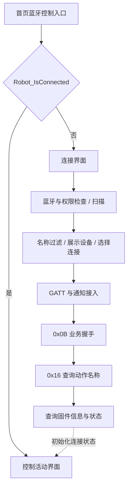

# 原 APK 蓝牙连接与控制界面分析

日期：2026-10-08。样本：`com.robosen.K1app` / `4.75.20260601`。

分类：文档 / 静态分析。关联 PRD-001 v1.1 的 REQ-BLE-001、REQ-CTL-001/002、REQ-UX-001，以及 T03、T04、T06。本报告不新增需求，不修改 Flutter 行为，不作为机器人实机验收。

## 1. 结论与边界

控制逻辑以 `ControlInterfaceScript` 为核心，包括双轴八方向输入、三个可更换的动作快捷键、音量调节、电量反馈、视频录制、设置和返回入口。方向控制、动作文件播放、机器人状态回传分别有独立调用路径。

本机保留了 ARM64 汇编、方法目录和历史分析报告，没有原始 `apk/`、`analysis/unpacked/`、完整 `cpp2il/` 和 `jadx/` 目录。因此本次恢复的是逻辑结构，不能确认准确的控件位置、颜色、图标、横竖屏设置、完整本地化文案，以及 Unity 场景 / Prefab 实际绑定了哪套脚本。以下图示是调用关系，不是原界面截图。地址均为该样本 ELF VA。

证据等级：静态分析。未连接机器人、未发送命令，没有原应用操作录屏或新应用实机运动结果。

## 2. 连接入口与两套连接页面

`MainInterfaceScript.ToBTControlBtnClick` 检查 `MainScript.Robot_IsConnected`，已连接时打开活动界面，未连接时调用 `ToConnectBtnClick`。通用界面调用的类型指针尚未在本机解析，不能直接确认所加载的连接 Prefab。



底层使用 BLE GATT。已存档的 Service 为 `FFE0`，写入和订阅 Characteristic 为 `FFE1`；完整 UUID、MTU 和订阅顺序见 [蓝牙协议分析](蓝牙协议分析.md)。此前用户展示的 U盘模式属于另一条功能路径。

| 类 | 静态页面行为 | 构造函数的名称过滤 |
|---|---|---|
| `BleConnectInterfaceScript` | 创建设备列表项、显示名称与数量；点击项停止扫描并连接；有重扫、等待和失败处理 | `StartsWith("K1")` 或 `StartsWith("k1")`，前缀不带连字符 |
| `ConnectBleCanvasScript2` | 正常、搜索中、无设备、可连接、连接中、连接成功、错误等状态；有滚动与当前设备居中逻辑 | `StartsWith("GSEG-")` |

第一套有明确 K1 名称证据。第二套可能是保留的其他产品 / 页面实现，这是推断；缺少场景绑定证据，不能认定它就是当前 K1 连接页，也不能把两套行为合并。

K1 脚本在已有全局选定设备时忽略扫描回调；命中名称后创建 `BTDevice` 并加入设备列表。`DevBtnClick` 依次停止扫描、设置选定设备、连接、清理列表并更新提示。两套构造函数保留 Android 定位、蓝牙扫描和连接权限字符串；K1 扫描协程按 SDK 版本 30 分支处理权限。字符串存在不代表所有系统都会请求全部权限。扫描期限读取外部浮点常量，本次没有原始 ELF 可重新读取，不能给出可靠秒数。

`Robot_ConnectDone` 之后仍需 `CheckBleConnecting`：注册握手回调并发送空载荷 `0x0B`，重试计数上限为 3；随后注册文件夹动作名与结束回调，发送 `0x16`，有独立重试及失败断开路径；再查询 `0xF8` 固件日期、`0x0F` 状态。后续 [动作中心分析](动作中心分析.md) 已找到被该协程实际消费的三目录表：`Action/`、`Action/skill/`、`DownloadAction/`；请求前的斜线处理 SDK 方法仍待确认。另一套连接脚本还查询 `0xF1` 序列号，不能自动归入 K1 页面。

## 3. 控制页的逻辑组成

| 部件 / 入口 | 已确认行为 |
|---|---|
| 方向输入 | 读取 `Horizontal` / `Vertical`，判定八方向，周期发送空载荷指令 |
| 三个快捷动作 | 默认左拳、右拳、双拳；可进入选择面板更换绑定动作 |
| 音量控件 | 从状态同步音量；修改时取消旧等待，延迟发送最后值 |
| 电量显示 | 读取回传状态字段并更新 UI；未完成物理标定 |
| `RecordButton` | 打开 / 关闭视频录制面板，接入 `WebCamRecorder_robosen` |
| `ChangeActionNameBtn` | 打开三项动作选择面板，支持默认动作、确认和取消 |
| `ToSettingButton` | 名称分发器直接打开活动界面；另有行为不同的同用途方法 |
| `ControlCanvasReturnBtn` | 录制面板打开时先关闭录制；否则关闭控制页 |

`Start` 注册 `BTDevice.RobotStates`，发一次空载荷 `0x0F`，再读取快捷键配置。`SetCurrentState` 分别把状态对象的音量、电量字段更新到 UI。

## 4. 八方向、发送节奏与松手停止

设水平轴为 H，垂直轴为 V，中心区约为 -0.5～0.5。表中方向描述输入位置；斜向命令的实际步态 / 转向仍需实测。

| 输入 | H | V | 指令 | 赋值 VA |
|---|---|---|---|---|
| 上 | 中心 | >0.5 | `0x01` | `0x20B7834` |
| 右上 | >0.5 | >0.5 | `0x02` | `0x20B78F8` |
| 右 | >0.5 | 中心 | `0x03` | `0x20B78A0` |
| 右下 | >0.5 | <-0.5 | `0x04` | `0x20B7AC4` |
| 下 | 中心 | <-0.5 | `0x05` | `0x20B793C` |
| 左下 | <-0.5 | <-0.5 | `0x06` | `0x20B7994` |
| 左 | <-0.5 | 中心 | `0x07` | `0x20B79CC` |
| 左上 | <-0.5 | >0.5 | `0x08` | `0x20B7B20` |

八个分支共用 `BTDevice.SendData`，载荷指针为零，按既有组包实现对应空载荷。中心区不发方向指令。

发送前检查已连接、共享 `IsPlaying` 为假、更新计数器为零。VA `0x20B7A50～0x20B7A5C` 的计数等价于 `counter = counter + 1 > 12 ? 0 : counter + 1`，由此推得每 13 次满足连接 / 非播放条件的 `FixedUpdate` 检查一次输入。缺少 Unity 固定时间步配置，不能写成已确认的 100ms 或 260ms；松手也要等下一次输入检查。

停止条件比方向中心区严格：当前 H、V **都恰好为 0**，且上次检查至少一个轴非零，才取消旧停止协程并启动 `JoySendStop`。仅进入 ±0.5 中心区不触发该分支。触摸松手是否让轴精确归零，需要运行取证。

`JoySendStop` 发 5 次空载荷 `0x0C`，每次等待外部 float 常量。存档 [蓝牙协议分析](蓝牙协议分析.md) 记录该值约 0.2 秒；本次重新确认命令和次数，没有原始 ELF 可独立重读常量。停止重发的物理效果、重新拖动时与方向发送的交互仍需实测。

## 5. 快捷动作配置、播放与互斥

`GetPreActionData` 从应用本地 `/ActionSave.data` 读取 JSON；缺少配置时创建默认值。`PreActionBtnInfo.Init` 按 `AppConfigInfo.NowServices` 分支保留两组路径：`ProAction/打左拳`、`ProAction/打右拳`、`ProAction/打双拳`，以及对应 `Left Punch`、`Right Punch`、`Double Punch`。`SavePreActionData` 保存 JSON 并绑定三个按钮；`SetValue` 保存完整路径，显示最后一个 `/` 后的名字。

选择面板的三个 `TempSetButton` 打开 `RobotActionInterfaceScript.Open`，传入模式值 3 和对应回调。`SetTemp1/2/3` 分别更新配置三项；确认调用保存回调，取消关闭面板，默认动作按钮创建默认配置。虽然入口打印“未完成！！修改预设动作界面”，后续确实调用 `ShowPanel`，不能依据日志判定没有实现。

`ActionPreinstallBtnScript.MainBtnClick`：

```text
按钮文字为空 → 返回
共享 IsPlaying 为真 → 发送空载荷 0x0C → IsPlaying = false
否则 → GB18030 编码完整动作路径 → 发送 0x17 → IsPlaying = true
```

`0x20B8AA4` 读取路径，`0x20B8AF0～0x20B8AFC` 以 `0x17` 发送编码结果。这是控制页快捷动作的载荷路径，区别于方向码，也区别于编程页面对临时文件路径的扩展名处理。

三个按钮共享播放标记，`FixedUpdate` 读取同一标记并跳过方向输入。播放中点任意一个有文字的快捷键先进入停止分支，并非立即切换动作。`BLEProtocol_ActionProgress` 读取非空载荷首字节，值 **≥100** 时清除共享标记；该回调本身没有动作 ID 匹配或完成超时处理。

这里确认的是原应用 UI 解锁条件，不证明动作成功。停止分支发命令后立即修改本地标记，未在此处等待机器人停止 ACK；也不能据此认定 `0x0C` 能中止全部编程文件。

## 6. 音量、视频与退出

音量：`ChangeRobotVolume` 在已连接时取消上次等待协程；`WaitAndAyncVolume` 的立即数确认等待 0.5 秒，然后把整数值写入单字节，发送 `0x0D`。持续拖动时主要发送最后值。Slider 的序列化范围不可见，不能凭一个字节载荷断言 UI 量程。

视频：`RecordPanleScript.RecordBtnClick` 调用 `WebCamRecorder_robosen.StartRecord/StopRecord`，后者还有 `InitWebCamTexture`；`CompletedFileWriting` 明确包含“视频录制保存路径”“视频文件存在”等字符串。可以确认录制输出为视频，拍摄视角、预览布局和保存权限仍需资源 / 运行取证。该入口不能作为手掰动作采集或机器人动作文件录制的证据。

退出：`ReturnButtonClick` 先处理录制面板。`Close` 异步状态机移除 `RobotStates` 监听、关闭录制；已连接时等待 `SendStopWaitClose`，再调用基类关闭。后者发送 5 次 `0x0C`，每轮调用延时函数，参数 200（按该托管延时路径解释为 200ms），同时显示 / 关闭等待提示。断线分支不能发出有效停止，不表示机器人已经物理停止。

设置入口必须分开看：`BtnClickMothed` 的 `ToSettingButton` 分支直接调用 `ShowActivityInterface`；另一方法 `ToSettingBtnClick` 有 `ActionNotDone/Wait` 提示和停止等待分支。缺少实际 UnityEvent 绑定与界面切换基类完整证据，不能统一宣称“进入设置必然停止”。

## 7. 与当前 Flutter 的差异及适用范围

| 项目 | APK 静态证据 | 当前 Flutter | 判断 |
|---|---|---|---|
| 扫描名称 | K1 类接受 `K1` / `k1` 前缀 | `RobotDevice.supported` 仅接受 `K1-` / `K1AI-`，区分大小写 | 名称不符合 Flutter 条件会被隐藏。没有实际广播名，不能认定是当前搜索不到设备的根因 |
| 控制输入 | 双轴八方向 | 四个按住按钮，命令 1/3/5/7 | 四方向符合已批准 CR-003；八方向发现不自动扩充需求 |
| 方向周期 | 每 13 次有效固定更新检查 | 首次立即发，随后每 100ms | 当前值为临时实现，尚未与原版时间步校准 |
| 停止 | 松手重发 5 次；退出有独立等待流程 | 5 次、间隔 200ms，并有生命周期处理 | 次数有来源，物理效果仍需 K1AI 对照 |
| 快捷动作、音量、视频 | 有相应逻辑 | `ControlPage` 未提供相应控件 | 未纳入 CR-003 首批控制范围；本次不加入代码 |
| 电量 | 状态字段驱动控件 | 显示原始值 | 未完成标定，不能直接认定为可靠百分比 |

本轮补强 T03/T04/T06 参考证据，没有完成 TC-BLE、TC-CTL、TC-EVID 或端到端验收，也未确认 K1/K1AI 的物理兼容性。

## 8. 可复核证据

| 事项 | 文件 / 关键位置 |
|---|---|
| 首页分流 | [ToBTControlBtnClick](../native/MainInterfaceScript.ToBTControlBtnClick.20c7648.asm)，`0x20C7694`、`0x20C76BC` |
| K1 名称过滤 | [构造函数](../native/BleConnectInterfaceScript..ctor.20a2b44.asm)，`0x20A2D38`、`0x20A2D68`；[ScanDevice](../native/BleConnectInterfaceScript.Unity2BTCommandControl_ScanDevice.20a237c.asm) |
| 设备项与点击 | [AddOneBleDev](../native/BleConnectInterfaceScript.AddOneBleDev.20a2540.asm)、[DevBtnClick](../native/BleConnectInterfaceScript.DevBtnClick.20a2888.asm) |
| 另一连接页过滤 | [构造函数](../native/ConnectBleCanvasScript2..ctor.20b1b0c.asm)，`0x20B1C18` |
| K1 初始化 | [CheckBleConnecting](../native/_CheckBleConnecting_d__29.MoveNext.20a5098.asm)，`0x20A54EC`、`0x20A5B38`；[GetRobotInfos](../native/_GetRobotInfos_d__31.MoveNext.20a64b4.asm) |
| 控制初始化 / 状态 | [Start](../native/ControlInterfaceScript.Start.20b60b8.asm)、[SetCurrentState](../native/ControlInterfaceScript.SetCurrentState.20b68f0.asm) |
| 八方向、周期、归零 | [FixedUpdate](../native/ControlInterfaceScript.FixedUpdate.20b76a4.asm)，`0x20B7754`、`0x20B79DC`、`0x20B7A50` |
| 松手停止 | [JoySendStop](../native/_JoySendStop_d__82.MoveNext.20b8178.asm)，`0x20B81D8`、`0x20B8230` |
| 快捷键配置 | [Init](../native/PreActionBtnInfo.Init.20b6f54.asm)、[GetPreActionData](../native/ControlInterfaceScript.GetPreActionData.20b61a8.asm)、[SavePreActionData](../native/ControlInterfaceScript.SavePreActionData.20b708c.asm) |
| 动作选择 | [SetPreinstallActionTipPlane.BtnClick](../native/SetPreinstallActionTipPlane.BtnClick.20e6240.asm)，`0x20E6420`、`0x20E64BC` |
| 动作载荷 / 解锁条件 | [MainBtnClick](../native/ActionPreinstallBtnScript.MainBtnClick.20b8970.asm)，`0x20B8A98～0x20B8AFC`；[ActionProgress](../native/ActionPreinstallBtnScript.BLEProtocol_ActionProgress.20b8910.asm)，`0x20B8928` |
| 音量 | [ChangeRobotVolume](../native/ControlInterfaceScript.ChangeRobotVolume.20b6b10.asm)、[WaitAndAyncVolume](../native/_WaitAndAyncVolume_d__61.MoveNext.20b85f4.asm)，`0x20B86F0`、`0x20B86BC` |
| 视频 | [RecordBtnClick](../native/RecordPanleScript.RecordBtnClick.20f8660.asm)、[CompletedFileWriting](../native/RecordPanleScript.CompletedFileWriting.20f82e8.asm)、[InitWebCamTexture](../native/WebCamRecorder_robosen.InitWebCamTexture.20fa1a0.asm) |
| 关闭 | [Close 状态机](../native/_Close_d__71.MoveNext.20b7db4.asm)、[SendStopWaitClose](../native/_SendStopWaitClose_d__73.MoveNext.20b82d8.asm) |
| 设置入口差异 | [BtnClickMothed](../native/ControlInterfaceScript.BtnClickMothed.20b62c8.asm)，`0x20B6494`；[ToSettingBtnClick](../native/ControlInterfaceScript.ToSettingBtnClick.20b7274.asm) |

后续需补齐实际连接 / 控制页录屏、Unity 场景绑定、完整广播名、固件信息、固定时间步，以及八方向、松手、快捷动作完成 / 中止的原应用实机记录。原应用观察与新应用验证应分别记录。
